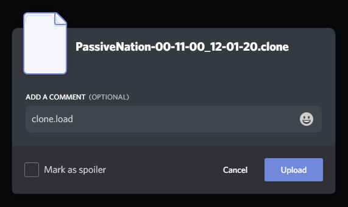

# Loading a Save


Best results are achieved if you load a save in a new server with no channels or roles, this is recommended but optional


## Setting up

1. Invite the bot to your server [https://discordapp.com/oauth2/authorize?client\_id=500791607839162376&scope=bot&permissions=8](https://discordapp.com/oauth2/authorize?client_id=500791607839162376&scope=bot&permissions=8)
2. Ensure you and the bot both have administrator permissions
3. Find your `.clone` file from earlier, this contains all the save information for your server

## Loading the Save

1. attach your `.clone` file with the message `clone.load`

     
   - Additionally you can specify `nobans` to stop the bot from copying user bans over. Do so by running the load command with the `nobans` parameter ex. `clone.load nobans` 

2. The bot will automatically create roles, channels, categories etc. and apply the correct settings and permissions to each
3. Enjoy your backup server
4. In order to load messages, use the `clone.loadmessages` command in the channel you wish to load messages for, you will need to attach the `.clone` file like in step 1.

